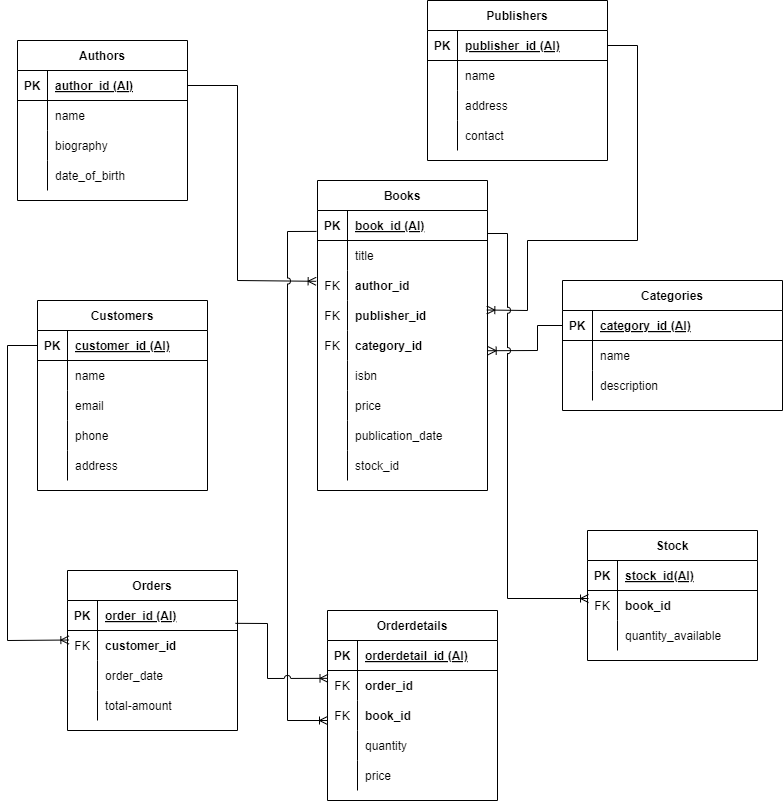

# UAS Basis Data Lanjutan
## Membuat Database BookStore

Project ini menjelaskan tentang pembuatan database pada sebuat toko buku dengan nama database "bookstore". Serta penggunaan fungsi agregat pada potongan querynya, membuat trigger, tabel virtual (view), menerapkan query innerjoin, leftjoin, subquery, having, wildcards, serta melakukan backup database dengan *mysqldump*. 

Pada database ini dibuat 8 tabel yaitu:
- Tabel Authors untuk menyimpan data Penulis
- Tabel Categories untuk menyimpan data Kategori
- Tabel Publishers untuk menyimpan data Penerbit
- Tabel Books untuk menyimpan data buku, dan memiliki foreign key yang merujuk ke tabel Authors, Publishers, Categories, dan Stock
- Tabel Customers untuk menyimpan data pelanggan
- Tabel Orders untuk menyimpan data pesanan yang dilakukan oleh pelanggan, dengan foreign key ke tabel Customers.
- Tabel OrderDetails untuk menyimpan rincian tiap pesanan, menghubungkan pesanan dengan buku yang dipesan.
- Tabel Stock untuk menyimpan data stok buku, dengan foreign key ke tabel Books.

## Membuat tabel pada database BookStore
Query untuk membuat tabel pada database bookstore

```sh
-- Membuat tabel Authors
CREATE TABLE Authors (
    author_id INT PRIMARY KEY AUTO_INCREMENT,
    name VARCHAR(255) NOT NULL,
    biography TEXT,
    date_of_birth DATE
);
-- Membuat tabel Categories
CREATE TABLE Categories (
    category_id INT PRIMARY KEY AUTO_INCREMENT,
    name VARCHAR(255) NOT NULL,
    description TEXT
);
-- Membuat tabel Publishers
CREATE TABLE Publishers (
    publisher_id INT PRIMARY KEY AUTO_INCREMENT,
    name VARCHAR(255) NOT NULL,
    address TEXT,
    contact VARCHAR(255)
);
-- Membuat tabel Books
CREATE TABLE Books (
    book_id INT PRIMARY KEY AUTO_INCREMENT,
    title VARCHAR(255) NOT NULL,
    author_id INT,
    publisher_id INT,
    category_id INT,
    isbn VARCHAR(13) UNIQUE,
    price DECIMAL(10, 2) NOT NULL,
    publication_date DATE,
    stock_id INT,
    FOREIGN KEY (author_id) REFERENCES Authors(author_id),
    FOREIGN KEY (publisher_id) REFERENCES Publishers(publisher_id),
    FOREIGN KEY (category_id) REFERENCES Categories(category_id)
);
-- Membuat tabel Customers
CREATE TABLE Customers (
    customer_id INT PRIMARY KEY AUTO_INCREMENT,
    name VARCHAR(255) NOT NULL,
    email VARCHAR(255) UNIQUE,
    phone VARCHAR(20),
    address TEXT
);
-- Membuat tabel Orders
CREATE TABLE Orders (
    order_id INT PRIMARY KEY AUTO_INCREMENT,
    customer_id INT,
    order_date DATE NOT NULL,
    total_amount DECIMAL(10, 2) NOT NULL,
    FOREIGN KEY (customer_id) REFERENCES Customers(customer_id)
);
-- Membuat tabel OrderDetails
CREATE TABLE OrderDetails (
    order_detail_id INT PRIMARY KEY AUTO_INCREMENT,
    order_id INT,
    book_id INT,
    quantity INT NOT NULL,
    price DECIMAL(10, 2) NOT NULL,
    FOREIGN KEY (order_id) REFERENCES Orders(order_id),
    FOREIGN KEY (book_id) REFERENCES Books(book_id)
);
-- Membuat tabel Stock
CREATE TABLE Stock (
    stock_id INT PRIMARY KEY AUTO_INCREMENT,
    book_id INT,
    quantity_available INT NOT NULL,
    FOREIGN KEY (book_id) REFERENCES Books(book_id)
);
```

## Relasi Antar Tabel

Berikut adalah ER Diagram dari database BookStore dengan relasi tabel seperti berikut:



Berikut adalah penjelasan mengenai relasi antar tabel dalam skema database Bookstore:

- Authors dan Books:
Tabel Books memiliki kolom `author_id` yang merupakan *forein key* yang merujuk ke `author_id` di tabel Authors. Ini menunjukkan bahwa satu buku ditulis oleh satu penulis (relasi satu ke satu atau satu penulis bisa memiliki banyak buku).

- Categories dan Books:
Tabel Books memiliki kolom `category_id` yang merupakan *forein key* yang merujuk ke `category_id` di tabel Categories. Ini menunjukkan bahwa satu buku hanya dapat terhubung dengan satu kategori (relasi satu ke satu).

- Publishers dan Books:
Tabel Books memiliki kolom `publisher_id` yang merupakan *forein key* yang merujuk ke `publisher_id` di tabel Publishers. Ini menunjukkan bahwa satu buku diterbitkan oleh satu penerbit (relasi satu ke satu atau satu penerbit bisa memiliki banyak buku).

- Customers dan Orders:
Tabel Orders memiliki kolom `customer_id` yang merupakan *forein key* yang merujuk ke `customer_id` di tabel Customers. Ini menunjukkan bahwa satu pesanan dibuat oleh satu pelanggan (relasi satu ke satu atau satu pelanggan bisa memiliki banyak pesanan).

- Orders dan OrderDetails:
Tabel OrderDetails memiliki kolom `order_id` yang merupakan *forein key* yang merujuk ke `order_id` di tabel Orders. Ini menunjukkan bahwa satu detail pesanan terhubung dengan satu pesanan tertentu (relasi satu ke banyak).

- Books dan OrderDetails:
Tabel OrderDetails memiliki kolom `book_id` yang merupakan *forein key* yang merujuk ke `book_id` di tabel Books. Ini menunjukkan bahwa satu detail pesanan berhubungan dengan satu buku tertentu yang dipesan (relasi satu ke banyak).

- Books dan Stock:
Tabel Stock memiliki kolom `book_id` yang merupakan *forein key* yang merujuk ke `book_id` di tabel Books. Ini menunjukkan bahwa satu entri stok (jumlah buku yang tersedia) terhubung dengan satu buku tertentu (relasi satu ke satu atau satu buku dapat memiliki satu entri stok).

## Trigger

Trigger ini dibuat untuk menanggapi perubahan data di dalam tabel. Misalnya, ketika sebuah baris data dimasukkan ke dalam tabel, trigger dapat dipicu untuk melakukan tugas tambahan seperti memperbarui tabel lain, mengirim notifikasi, atau melakukan validasi data.

### Trigger 1
Query Trigger yang dibuat untuk membuat total_amount pada tabel orders menjadi otomatis berubah saat ada pelanggan yang membeli lebih dari satu buku 

```sh
DELIMITER //

CREATE TRIGGER calculate_order_total
AFTER INSERT ON OrderDetails
FOR EACH ROW
BEGIN
    DECLARE total DECIMAL(10, 2);
    

    SET total = NEW.quantity * NEW.price;
    
  
    UPDATE Orders
    SET total_amount = total_amount + total
    WHERE order_id = NEW.order_id;
END;
//

DELIMITER ;
```

Penjelasan Query:
1. DELIMITER //: Mengubah delimiter sementara dari ; ke //. Ini diperlukan karena perintah CREATE TRIGGER melibatkan beberapa pernyataan SQL dan kita perlu menggunakan delimiter berbeda untuk menyelesaikan definisi trigger.
2. CREATE TRIGGER calculate_order_total: Membuat trigger dengan nama calculate_order_total.
3. AFTER INSERT ON OrderDetails: Menentukan bahwa trigger ini akan dijalankan setelah (AFTER) setiap operasi INSERT pada tabel OrderDetails.
4. FOR EACH ROW: Menunjukkan bahwa trigger ini akan dijalankan untuk setiap baris yang dimasukkan ke tabel OrderDetails.
5. BEGIN ... END: Blok perintah yang akan dieksekusi oleh trigger.
6. DECLARE total DECIMAL(10, 2): Mendeklarasikan variabel lokal total dengan tipe data DECIMAL(10, 2) untuk menyimpan hasil perhitungan subtotal.
7. SET total = NEW.quantity * NEW.price: Menghitung subtotal dengan mengalikan quantity dan price dari baris baru (NEW) yang dimasukkan ke OrderDetails dan menyimpan hasilnya dalam variabel total.
8. UPDATE Orders ...: Mengupdate kolom total_amount pada tabel Orders.
   - SET total_amount = total_amount + total: Menambahkan nilai total yang baru dihitung ke total_amount yang ada.
   - WHERE order_id = NEW.order_id: Menentukan baris di tabel Orders yang akan diupdate, yaitu baris dengan order_id yang sama dengan order_id dari baris baru yang dimasukkan ke OrderDetails.
9. END;: Menandakan akhir dari blok perintah trigger.
10.//: Mengakhiri definisi trigger dengan delimiter yang ditentukan (//).
11.DELIMITER ;: Mengembalikan delimiter ke nilai default (;).

### Trigger 2
Query trigger Untuk mengubah quantity stok saat pada tabel orderdetails terjadi penambahan data pembelian, sehingga field quantity_available pada tabel stock akan berkurang otimatis

```sh
DELIMITER //

CREATE TRIGGER update_stock_after_order_detail
AFTER INSERT ON OrderDetails
FOR EACH ROW
BEGIN
    DECLARE change_amount INT;
    DECLARE book_id_temp INT;
    

    SELECT NEW.book_id, NEW.quantity INTO book_id_temp, change_amount;
    

    IF (SELECT COUNT(*) FROM Stock WHERE book_id = book_id_temp) > 0 THEN
        UPDATE Stock
        SET quantity_available = quantity_available - change_amount
        WHERE book_id = book_id_temp;
    ELSE
        INSERT INTO Stock (book_id, quantity_available)
        VALUES (book_id_temp, -change_amount); 
    END IF;
END //

DELIMITER ;
```
Penjelasan Query:

1. DELIMITER //: Mengubah delimiter sementara dari ; ke //. Ini diperlukan karena perintah CREATE TRIGGER melibatkan beberapa pernyataan SQL dan kita perlu menggunakan delimiter berbeda untuk menyelesaikan definisi trigger.
2. CREATE TRIGGER update_stock_after_order_detail: Membuat trigger dengan nama update_stock_after_order_detail.
3. AFTER INSERT ON OrderDetails: Menentukan bahwa trigger ini akan dijalankan setelah (AFTER) setiap operasi INSERT pada tabel OrderDetails.
4. FOR EACH ROW: Menunjukkan bahwa trigger ini akan dijalankan untuk setiap baris yang dimasukkan ke tabel OrderDetails.
5. BEGIN ... END: Blok perintah yang akan dieksekusi oleh trigger.
6. DECLARE change_amount INT: Mendeklarasikan variabel lokal change_amount dengan tipe data INT untuk menyimpan jumlah perubahan stok.
7. DECLARE book_id_temp INT: Mendeklarasikan variabel lokal book_id_temp dengan tipe data INT untuk menyimpan book_id dari baris baru yang dimasukkan ke OrderDetails.
8. SELECT NEW.book_id, NEW.quantity INTO book_id_temp, change_amount: Mengambil book_id dan quantity dari baris baru (NEW) yang dimasukkan ke OrderDetails dan menyimpannya ke dalam variabel book_id_temp dan change_amount.
9. IF (SELECT COUNT(*) FROM Stock WHERE book_id = book_id_temp) > 0 THEN: Mengecek apakah ada baris di tabel Stock dengan book_id yang sama dengan book_id_temp.
- Jika ada (COUNT(*) > 0), maka:
-- UPDATE Stock SET quantity_available = quantity_available - change_amount WHERE book_id = book_id_temp: Mengupdate kolom quantity_available pada tabel Stock dengan mengurangkan change_amount dari stok yang tersedia untuk book_id yang sesuai.
- Jika tidak ada (COUNT(*) = 0), maka:
-- INSERT INTO Stock (book_id, quantity_available) VALUES (book_id_temp, -change_amount): Menyisipkan baris baru ke tabel Stock dengan book_id yang sesuai dan quantity_available yang negatif (menandakan pengurangan stok).
10. END IF: Menandakan akhir dari blok IF.
11. END //: Menandakan akhir dari blok perintah trigger.
12. DELIMITER ;: Mengembalikan delimiter ke nilai default (;).
(optional) Third:

### View
View dalam konteks basis data adalah objek virtual yang menyajikan data yang diambil dari satu atau lebih tabel. View berfungsi seperti tabel, namun tidak menyimpan data secara fisik. Sebaliknya, view menyimpan definisi query yang akan dijalankan setiap kali view diakses.

Query untuk membuat sebuah view bernama OrderDetailsView yang menyajikan informasi lengkap tentang setiap order di toko buku, termasuk detail customer, buku yang dibeli, dan harga. 

```sh
CREATE VIEW OrderDetailsView AS
SELECT
    o.order_id,
    c.name AS customer_name,
    b.title AS book_title,
    od.quantity,
    b.price,
    od.quantity * b.price AS subtotal,
    o.total_amount
FROM
    Orders o
    JOIN Customers c ON o.customer_id = c.customer_id
    JOIN OrderDetails od ON o.order_id = od.order_id
    JOIN Books b ON od.book_id = b.book_id;
```
1. CREATE VIEW OrderDetailsView AS:
   - Membuat sebuah view dengan nama OrderDetailsView. View adalah hasil dari sebuah query yang disimpan sebagai objek virtual di dalam database. View dapat digunakan seperti tabel biasa dalam operasi SELECT.
2. SELECT ...: Mendefinisikan kolom-kolom yang akan dimasukkan ke dalam view.
   - `o.order_id`: ID order dari tabel Orders.
   - `c.name AS customer_name`: Nama customer dari tabel Customers, dengan alias `customer_name`.
   - `b.title AS book_title`: Judul buku dari tabel Books, dengan alias `book_title`.
   - `od.quantity`: Jumlah buku yang dipesan dari tabel OrderDetails.
   - `b.price`: Harga per buku dari tabel Books.
   - `od.quantity * b.price AS subtotal`: Menghitung subtotal untuk setiap baris order dengan mengalikan jumlah buku (quantity) dengan harga buku (price), dengan alias subtotal.
   - `o.total_amount`: Total jumlah seluruh order dari tabel Orders.
3. FROM ...: Menentukan tabel-tabel yang digunakan dalam query.
   - `Orders o`: Tabel yang berisi informasi order, diberi alias o.
   - `Customers c`: Tabel yang berisi informasi customer, diberi alias c.
   - `OrderDetails od`: Tabel yang berisi detail dari setiap order, diberi alias od.
   - `Books b`: Tabel yang berisi informasi tentang buku-buku yang dibeli, diberi alias b.
4. JOIN ...: Menghubungkan tabel-tabel tersebut menggunakan kondisi join.
   - `JOIN Customers c ON o.customer_id = c.customer_id`: Menghubungkan tabel Orders dengan tabel Customers berdasarkan customer_id.
   - `JOIN OrderDetails od ON o.order_id = od.order_id`: Menghubungkan tabel Orders dengan tabel OrderDetails berdasarkan order_id.
   - `JOIN Books b ON od.book_id = b.book_id`: Menghubungkan tabel OrderDetails dengan tabel Books berdasarkan book_id.

#### Tampilan View 

For production release:

```sh
gulp build --prod
```

Generating pre-built zip archives for distribution:

```sh
gulp build dist --prod
```

## Docker

Dillinger is very easy to install and deploy in a Docker container.

By default, the Docker will expose port 8080, so change this within the
Dockerfile if necessary. When ready, simply use the Dockerfile to
build the image.

```sh
cd dillinger
docker build -t <youruser>/dillinger:${package.json.version} .
```

This will create the dillinger image and pull in the necessary dependencies.
Be sure to swap out `${package.json.version}` with the actual
version of Dillinger.

Once done, run the Docker image and map the port to whatever you wish on
your host. In this example, we simply map port 8000 of the host to
port 8080 of the Docker (or whatever port was exposed in the Dockerfile):

```sh
docker run -d -p 8000:8080 --restart=always --cap-add=SYS_ADMIN --name=dillinger <youruser>/dillinger:${package.json.version}
```

> Note: `--capt-add=SYS-ADMIN` is required for PDF rendering.

Verify the deployment by navigating to your server address in
your preferred browser.

```sh
127.0.0.1:8000
```

## License

MIT

**Free Software, Hell Yeah!**

[//]: # (These are reference links used in the body of this note and get stripped out when the markdown processor does its job. There is no need to format nicely because it shouldn't be seen. Thanks SO - http://stackoverflow.com/questions/4823468/store-comments-in-markdown-syntax)

   [dill]: <https://github.com/joemccann/dillinger>
   [git-repo-url]: <https://github.com/joemccann/dillinger.git>
   [john gruber]: <http://daringfireball.net>
   [df1]: <http://daringfireball.net/projects/markdown/>
   [markdown-it]: <https://github.com/markdown-it/markdown-it>
   [Ace Editor]: <http://ace.ajax.org>
   [node.js]: <http://nodejs.org>
   [Twitter Bootstrap]: <http://twitter.github.com/bootstrap/>
   [jQuery]: <http://jquery.com>
   [@tjholowaychuk]: <http://twitter.com/tjholowaychuk>
   [express]: <http://expressjs.com>
   [AngularJS]: <http://angularjs.org>
   [Gulp]: <http://gulpjs.com>

   [PlDb]: <https://github.com/joemccann/dillinger/tree/master/plugins/dropbox/README.md>
   [PlGh]: <https://github.com/joemccann/dillinger/tree/master/plugins/github/README.md>
   [PlGd]: <https://github.com/joemccann/dillinger/tree/master/plugins/googledrive/README.md>
   [PlOd]: <https://github.com/joemccann/dillinger/tree/master/plugins/onedrive/README.md>
   [PlMe]: <https://github.com/joemccann/dillinger/tree/master/plugins/medium/README.md>
   [PlGa]: <https://github.com/RahulHP/dillinger/blob/master/plugins/googleanalytics/README.md>
